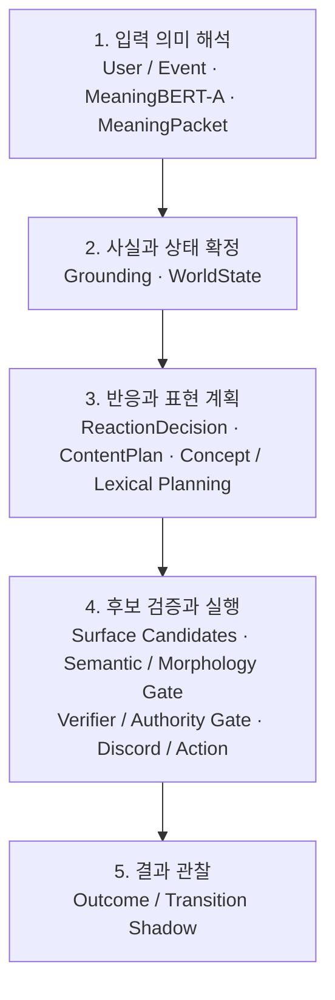
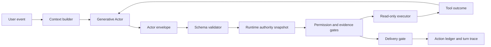

# AI Companion Architecture Portfolio

서로 다른 책임 구조로 동작하는 두 한국어 AI companion을 구현하고 검증하는 개인 연구 포트폴리오입니다.

| Companion | 중심 구조 | 자세히 보기 |
|---|---|---|
| **Rubrum** | encoder 기반 의미 판단 + 명시적 상태·정책 + 제한적 단어·형태소 조립 | [Rubrum 케이스스터디](docs/rubrum-case-study.md) |
| **Sapphirus** | 생성형 Actor + 외부 권한·실행·증거 계층 | [Sapphirus 케이스스터디](docs/white-case-study.md) |

두 프로젝트 모두 단순히 좋은 답변 하나를 고르는 대신, 독립 평가와 단계적 권한 승격을 사용합니다. 차이는 문맥을 읽을 수 있느냐가 아니라 의미 판단·행동 선택·표현 책임을 어디에 두느냐입니다.

## Rubrum — Judgment and State-Centered Companion

Rubrum은 의미 해석, grounding, 상태, 반응 결정, 내용 계획, 표면 표현, 결과 관찰을 독립된 계약으로 분리합니다. 검증되지 않은 모델과 후보에는 실제 출력권을 주지 않습니다.



### Rubrum의 현재 경계

- `CORE`: MeaningPacket, verifier, DecisionTrace·Outcome 공통 계약
- `CORE 전환 중`: ReactionDecision·ContentPlan 단일 책임 구조와 legacy 경로의 병행 전환
- `CANARY`: 검토된 일부 관계 비유와 단어·형태소 조립 반응군
- `SHADOW`: 결정론적 transition prediction과 실제 관찰 비교
- `RESEARCH`: SurfaceBERT-B. 어휘 의미 선택 heldout 실패로 실제 출력권 없음
- `FUTURE`: learned world model, planner, broad open-domain atomic NLG

대표적으로 SurfaceBERT-B 어휘 ranker는 dev `5/6`에서 독립 heldout `2/6`으로 무너졌습니다. 추가 epoch으로 밀어붙이지 않고 의미 적격성을 구조적 hard gate로 이동하고 모델의 책임을 동일 의미 후보의 잔여 표현 선호로 축소했습니다.

### Rubrum CPU 수직 표본

공개 예제는 검수된 MeaningPacket 이후의 흐름만 재현하며, 공개되지 않은 MeaningBERT checkpoint가 추론에 성공했다고 가장하지 않습니다.

```powershell
cd companions\black
python -m examples.rubrum_vertical_slice.demo
python -m unittest discover -s tests -p "test_*.py" -v
python scripts\audit_public_portfolio.py
```

- [Rubrum 아키텍처](docs/rubrum-architecture.md)
- [Rubrum 공개 주장 상태표](docs/rubrum-claim-status.md)
- [Rubrum 실험 원장](docs/rubrum-experiment-ledger.md)
- [Rubrum 실행 안내](companions/black/README.md)

---

## Sapphirus — External-First Generative AI Companion

Sapphirus는 생성형 LLM에게 대화와 `reply · silence · use_tool` 제안권을
유지하면서, 권한·실행·증거·전달의 사실성은 외부 런타임이 보장하도록 책임을
분리한 한국어 AI 컴패니언 프로젝트입니다.

이 저장소는 공개용 포트폴리오입니다. 모델 가중치, 원본 학습 데이터, Discord
식별자, 개인 대화 로그, 토큰, 로컬 DB는 포함하지 않습니다. `white`라는 경로는
초기 개발 명칭과 실행 호환성을 위해 유지합니다.

## 핵심 질문

> 생성형 Actor의 자연스러움과 주도권을 유지하면서, 어떤 책임은 모델이 아니라
> 외부 시스템이 강제로 보장해야 하는가?

초기에는 행동 경계를 Contract SFT로 모델에 학습했습니다. 후보는 clean base보다
크게 개선됐지만 사전에 고정한 critical gate를 통과하지 못했습니다. 성능 상승만
보고 승격하지 않고, 모델의 제안과 실제 세계의 권위를 분리하는 External-First
구조로 전환했습니다.



Actor의 발화가 “검색했다”, “기억했다”, “보냈다”고 주장하는 것만으로 실제 사건이
되지는 않습니다. 외부 `CapabilityState`, `PermissionState`, `ToolOutcome`,
`ActionLedger`, `DeliveryOutcome`이 확인한 것만 실행 사실로 취급합니다.

## 검증된 결과

| 단계 | 결과 | 결정 |
| --- | ---: | --- |
| Contract SFT 수동 계약 평가 | clean `70/200` → candidate `136/200` | 개선됐지만 승격 거절 |
| Critical boundary | `13/40` → `26/40` | 요구값 `40/40` 미달 |
| External-First known-failure replay | 외부 차단 가능 실패 `22/22` 격리 | 유용한 복구는 `5/22`로 제한적 |
| 신규 외부 통합 fixture | `16/16` 통과 | 외부 경계 구현 검증 |
| V5 로컬 구조 평가 | 의미 사례 `5/6` | 감정 인정·수량 보존 실패로 중단 |
| Discord read-only capability canary | 기능 `8/8` 완료 | 외부 기능 계층만 통과 |

마지막 canary는 Actor를 연결하기 전에 외부 Discord capability 계층을 격리 검증한
시험입니다. 의도적으로 LLM 요청, 네트워크 도구 호출, 영속 상태 변경을 모두
`0`으로 유지했으므로 Actor의 대화 품질 증거로 사용하지 않습니다.

수치의 정의와 해석 한계는 [평가 원장](docs/sapphirus-evaluation-ledger.md)과
[공개용 근거 요약](evidence/README.md)에 기록했습니다.

## 설계 전환

### 이전 가정

```text
LLM이 행동을 선택한다
→ LLM의 발화를 실행 사실로 신뢰한다
```

### 현재 구조

```text
LLM이 행동을 제안한다
→ 외부 런타임이 capability와 permission을 확인한다
→ executor가 허용된 행동만 수행한다
→ 실제 결과를 evidence로 기록한다
→ 최종 발화와 전달을 다시 검증한다
```

외부 계층은 일반 대화의 감정·농담·주제를 결정하거나 문장을 전면 재작성하지
않습니다. 실행 가능 여부, 실제 수행 여부, 민감한 영속 기억, 전달 범위처럼 외부에서
검증 가능한 경계만 소유합니다. V5에서 안전하고 구조적으로 올바른 답변이 수량
의미를 잘못 보존한 사례는 이 경계를 의도적으로 넓히지 않은 이유이기도 합니다.

## 지금 구현된 범위

- Qwen 계열 생성형 Actor와 3-action JSON 계약
- 640행, 320개 최소대조쌍, 8개 분야의 개별 작성 Contract SFT 자료
- clean base와 SFT candidate의 동일 조건 평가
- ActorBackend 추상화와 runtime-owned authority snapshot
- capability, memory, unsupported-claim, delivery gate
- 한 턴 최대 한 번의 도구 실행과 post-tool Actor 재호출
- tool outcome, action ledger, privacy-safe turn trace
- Discord shadow 실행과 제한된 read-only capability canary

## 아직 증명하지 않은 범위

- Actor → 실제 도구 → 결과 재입력 → 최종 Actor 답변 → Discord 전달의 완전한 live 수직 경로
- 제한 없는 Discord 운영
- 네트워크 검색과 영속 기억 쓰기
- 예약 알림, 선제 연락, 장기 목표 수행
- SFT candidate의 runtime 승격

P11A delivery canary는 모델과 listener를 기동했지만 허용 입력 관찰이 `0`건이어서
기능 판정에 사용하지 않았습니다. 실패하거나 비어 있는 실행을 성공 사례로
재분류하지 않는 것이 이 프로젝트의 평가 원칙입니다.

## 먼저 볼 문서

- [Sapphirus 케이스스터디](docs/white-case-study.md)
- [External-First 아키텍처](docs/sapphirus-architecture.md)
- [평가·승격 원장](docs/sapphirus-evaluation-ledger.md)
- [CPU 재현 예제](examples/sapphirus_external_first/README.md)
- [Legacy runtime snapshot 안내](companions/white/README.md)
- [개발 계보 메모](docs/white-mindmap.md)

## CPU 예제 실행

모델, Discord 토큰, 외부 네트워크 없이 공개 수직 경로를 실행할 수 있습니다.

```powershell
python -m unittest discover -s examples/sapphirus_external_first/tests -v
python -m examples.sapphirus_external_first.demo
```

예제는 Mock Actor가 read-only 도구를 제안하고, 외부 gate가 권한을 검사하고,
fixture executor의 결과를 두 번째 Actor 호출에 전달한 뒤, 최종 전달과 evidence
ledger를 기록하는 과정을 보여줍니다.

## 공개 범위와 재현성

공개 저장소에는 설계 문서, 비밀정보를 제거한 결과 요약, CPU reference slice와
테스트를 포함합니다. 실제 Qwen inference 결과와 수동 판정 원장은 hash-frozen
private artifact로 보관하지만, 사용자 문장과 모델 원문 출력은 공개하지 않습니다.

모델 학습과 실제 Discord 실행은 별도의 승인·실행 계약을 사용하며 이 저장소의
예제를 실행하는 것만으로 시작되지 않습니다.
