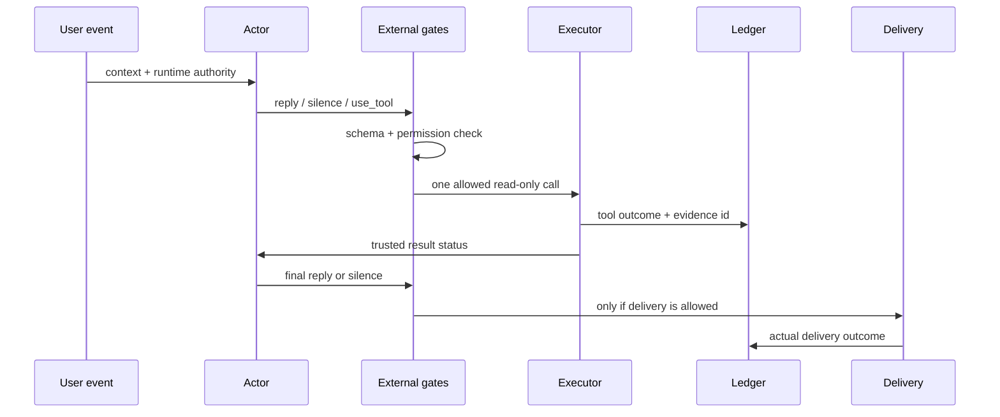

# Sapphirus 케이스스터디

관련 자료: [External-First 아키텍처](sapphirus-architecture.md) ·
[평가·승격 원장](sapphirus-evaluation-ledger.md) ·
[공개 주장 상태표](sapphirus-claim-status.md) ·
[CPU 재현 예제](../examples/sapphirus_external_first/README.md) ·
[공개 근거 요약](../evidence/README.md)

## 요약

Sapphirus는 생성형 LLM이 자연스러운 대화와 제한된 행동을 제안하되, 실제 권한과
실행 사실은 외부 런타임이 소유하도록 설계한 한국어 AI 컴패니언입니다.

이 프로젝트의 핵심 결과는 특정 후보 점수가 오른 사실보다 다음 의사결정입니다.

```text
Contract SFT로 70/200 → 136/200 개선
                ↓
critical boundary는 26/40에 머묾
                ↓
사전 정의한 승격 gate에 따라 후보 거절
                ↓
추가 학습보다 실패 책임을 먼저 분리
                ↓
External-First runtime 구현과 격리 검증
```

## 문제

생성형 컴패니언은 자연스럽게 답할 수 있지만, 다음 문장을 생성했다고 해서 실제
능력이나 사건이 생기지는 않습니다.

- “나중에 먼저 알려줄게.”
- “계정 설정에 저장했어.”
- “공지 메시지를 보냈어.”
- “검색해 봤는데 결과가 이래.”

스케줄러, 저장 권한, 메시지 executor, 검색 결과가 없는데도 이런 답을 만들 수
있습니다. 반대로 모든 판단을 규칙에 옮기면 생성형 Actor가 가진 대화 유연성과
즉흥성이 사라집니다.

연구 질문을 다음처럼 좁혔습니다.

> Actor에게 무엇을 말하고 어떤 행동을 제안할지는 맡기되, 외부에서 검증할 수 있는
> 사실은 어떻게 모델 밖에서 강제할 수 있는가?

## 1. 생성형 Actor 계약

첫 계약은 세 가지 행동만 허용합니다.

```json
{
  "action": "reply | silence | use_tool",
  "speech": "최종 한국어 발화 또는 빈 문자열",
  "tool_calls": [],
  "memory_candidates": []
}
```

`wait`, `notify`, `request_approval`, `finish`, `abort` 같은 장기 에이전트 행동은
학습 자료에 없으므로 v0.1 Actor에게 노출하지 않았습니다. 현재 능력을 넘어서는
enum을 먼저 추가하면 모델 오류와 계약 오류를 구분하기 어렵기 때문입니다.

## 2. Contract SFT

공개 비교에 사용한 clean Qwen3-8B 계열 기준선과 SFT candidate의 unsealed 출력은
자동 의미 판정기로 대체하지 않고 Codex가 건별로 판정했습니다. 이 비교 세트에서
clean 기준선의 수동 통과는 `70/200`이었습니다. 별도의 초기 lineage 선택 평가
`84/200`은 같은 평가 세트가 아니므로 성능 곡선처럼 직접 연결하지 않습니다.

실패를 다음 8개 분야로 분류했습니다.

1. capability와 외부 행동 권한
2. 정체성과 화자 분리
3. 기억 지속성
4. 일반 대화
5. 민감한 기억 제외
6. 답변과 침묵의 경계
7. 감정 지지
8. 도구 선택과 live 정보 정직성

이 분류에서 평가 문장이나 모델 출력을 재사용하지 않고, Codex가 각 행을 개별
작성하고 같은 절차로 검토한 640행의 SFT 자료를 만들었습니다. 이는 사람 작성
자료라는 뜻이 아닙니다. 320개의 최소대조쌍이며 일괄 템플릿 확장은 사용하지
않았습니다.

### 결과

| 지표 | Clean base | SFT candidate | 변화 |
| --- | ---: | ---: | ---: |
| Actor envelope valid | 200/200 | 200/200 | 동일 |
| Structural pass | 149/200 | 173/200 | +24 |
| 전체 수동 계약 평가 | 70/200 | 136/200 | +66 |
| Dev 수동 평가 | 57/160 | 110/160 | +53 |
| Critical boundary | 13/40 | 26/40 | +13 |
| Critical-severity pass | 23/95 | 66/95 | +43 |

### 승격 결정

후보는 다음 사전 정의 gate를 통과하지 못했습니다.

- Dev 수동 평가: 실제 `110/160`, 요구 `≥144/160`
- 분야별 Dev: 8개 분야 각각 요구 `≥18/20`, 모두 미달
- Critical boundary: 실제 `26/40`, 요구 `40/40`
- Critical-severity failure: 실제 29건, 요구 0건

일반 대화와 감정 지지의 clean 대비 회귀는 없었지만, 외부 행동 권한, 미래 연락,
화자 역할, 기억 종류, 민감 기억, 도구 결과 정직성에서 중대 실패가 남았습니다.

```text
Candidate promotion: REJECTED
Additional actor training: PAUSED
Active runtime replacement: NOT PERFORMED
```

## 3. 실패 책임 분리

64개의 후보 실패를 모델 의미 문제와 외부에서 강제로 막을 수 있는 문제로 다시
분해했습니다.

```text
외부에서 검증 가능한 경계
- 존재하지 않는 capability
- 허용되지 않은 tool과 memory write
- 실행 ledger 없는 완료 주장
- 민감하거나 일시적인 기억 후보
- 명백한 Discord 대상·침묵 경계

Actor에 남겨야 하는 의미 품질
- 감정 인정
- 수량과 조건 보존
- 자연스러운 관련성
- 대화의 주제와 태도
```

Known-failure replay에서는 외부 차단 대상으로 분류한 22건을 모두 격리했지만,
유용한 답변으로 복구한 것은 5건뿐이었습니다. 17건은 안전한 억제에 그쳤고,
59개의 모델 실패가 여전히 남았습니다.

이 결과는 guard가 모델 품질을 대체하지 못한다는 근거입니다.

## 4. External-First 전환



외부 계층이 소유하는 권위는 다음과 같습니다.

- `CapabilityState`: 현재 존재하는 기능
- `PermissionState`: 이번 요청에서 사용할 수 있는 기능
- `ToolState`: 사용 가능한 도구와 한 번의 호출 예산
- `MemoryPolicyState`: 영속 저장 가능 여부와 허용 종류
- `ActionLedger`: 실제 성공·실패·차단 기록
- `DeliveryOutcome`: 최종 전달 성공 여부

Actor 추론이나 외부 검색 문서는 runtime authority로 승격하지 않습니다. 도구 결과는
발화 근거가 될 수 있지만, 권한 자체를 바꿀 수는 없습니다.

## 5. External-First 검증

### Known-failure replay

- 외부 차단 가능 실패: 22건
- 격리: `22/22`
- 안전하고 유용한 복구: `5/22`
- 억제만 수행: 17건
- 잘못 차단한 원래 통과 답변: 0건

이는 이미 본 실패의 책임 분리가 맞는지 확인한 development replay이며 일반화
증거로 사용하지 않습니다.

### 신규 synthetic 통합 fixture

평가 입력과 exact 중복이 없는 16개 수동 synthetic fixture에서 다음 경계를
확인했습니다.

- authority spoofing
- snapshot contradiction
- post-tool loop
- ledger 없는 실행 주장
- 민감한 tool query
- 영속 기억 경계
- 중복·잘못된 Discord target
- trace 원문 누출

결과는 `16/16`이었지만 scripted Actor와 fixture executor를 사용한 외부 계약
시험이며, 실제 모델 품질이나 Discord 전달을 측정한 것은 아닙니다.

### Discord shadow와 V5

V4 shadow에서는 6건 중 5건이 의미상 통과했습니다. 한 출력이 사용자가 명시적으로
제외한 표현을 그대로 포함했고, 외부 lexical constraint가 없어 전체 gate를
실패했습니다.

V5는 한 번의 제약 보정과 좁은 deterministic fallback을 추가했습니다. 로컬 6건
평가에서는 권한·형식·침묵 경계를 통과했지만, “절반도 못 했다”를 “완료된 절반”으로
바꾸고 감정을 먼저 인정하지 않은 답변 때문에 다시 `5/6`에서 중단했습니다.

외부 gate는 이 답을 안전하고 구조적으로 유효하다고 판단했습니다. 수량 의미와
감정 반응은 외부 권한 계층이 대신 결정하지 않는다는 경계를 확인한 사례입니다.

## 6. Discord capability canary

Actor와 별개로 외부 기능 계층의 허용된 Discord command callback이 제한된 범위에서
완료되는지 검증했습니다.

```text
recall · summary · dashboard · companion_trace
companion_probe · voice_status · signals · checkins
```

- 허용된 명령: 8
- 완료된 명령: `8/8`
- LLM 요청: 0
- 네트워크 도구 호출: 0
- runtime 상태 변경: 0
- 영속 운영 메모리 접근: 0
- raw Discord ID 로그: 0

LLM 호출 0건은 결함이 아니라 격리 조건입니다. `8/8`은 callback 완료 수이고 exact
응답 문구는 저장하지 않았으므로 출력의 의미 정확도 점수가 아닙니다. 이 실험은
Actor가 아니라 외부 capability와 개인정보 경계를 검증했습니다.

## 현재 결론

Sapphirus는 “학습된 모델이 모든 것을 올바르게 판단한다”는 가정에서 출발하지
않습니다. Actor가 대화와 행동을 제안하고, 외부 런타임이 실제 세계에 대한 최소한의
진실만 강제합니다.

현재 다음은 아직 완료되지 않았습니다.

- 실제 Actor의 tool 선택부터 Discord 최종 전달까지 이어지는 live end-to-end 증명
- 네트워크 검색과 영속 기억 write canary
- 선제 알림과 장기 목표 계약
- 대화 품질 acceptance와 모델 승격

다음 기술 관문은 새로운 SFT가 아니라, 공개 예제와 같은 전체 수직 경로를 제한된
환경에서 실제 Actor로 관찰하고 각 단계의 evidence를 같은 turn trace에 연결하는
것입니다.
