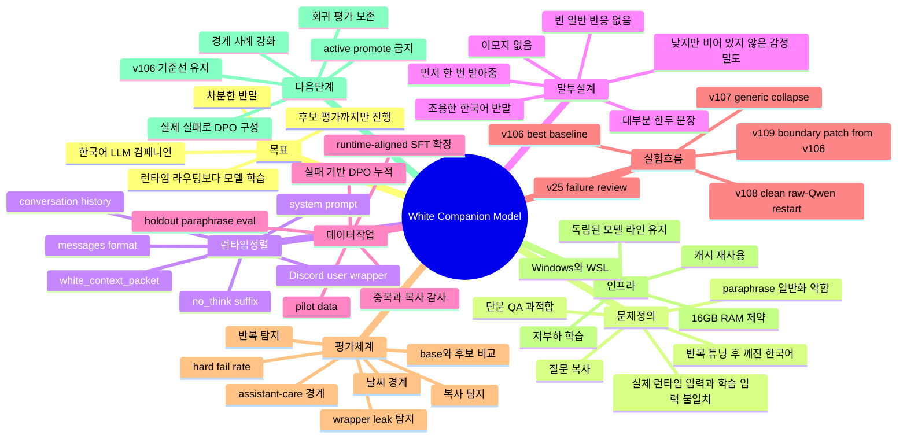

# White Companion Model 마인드맵

## 텍스트 구조

White의 중심 질문은 하나입니다. 작은 한국어 컴패니언 말투를 런타임 규칙이 아니라 모델 자체에 얼마나 안정적으로 학습시킬 수 있는가.

1. 목표
   - SFT, DPO, 이후 RL까지 고려한 한국어 LLM 컴패니언을 만든다.
   - White를 독립된 컴패니언 방향으로 유지한다.
   - 후보 학습, 평가, 리포트까지만 진행한다.

2. 핵심 문제
   - 초기 단문 질문/답변 SFT는 정확한 문장 패턴을 외우는 쪽으로 기울었다.
   - 실제 런타임 입력은 단순 user prompt가 아니라 system, context packet, history, Discord wrapper가 섞인 구조다.
   - 복사, 빈 일반 반응, 깨진 한국어, 경계 오해가 주요 실패로 남았다.

3. 데이터 전략
   - plain prompt/completion에서 runtime-aligned `messages` 형식으로 옮긴다.
   - 중복 답변, 복사 위험, 부자연스러운 말투, 깨진 문장을 매번 감사한다.
   - holdout은 학습 row와 분리하고 paraphrase 중심으로 유지한다.

4. 평가 전략
   - 같은 holdout으로 base와 후보 어댑터를 비교한다.
   - 겉보기 유창함보다 hard failure를 우선해서 본다.
   - 실제 clear fail을 DPO chosen/rejected 쌍으로 전환한다.

5. 현재 판단
   - v106이 아직 가장 강한 기준선이다.
   - v109는 일부 boundary patch로 의미가 있지만 promote할 수준은 아니다.
   - 다음 유효 작업은 실제 실패 답변을 모아 preference training을 하는 것이다.
