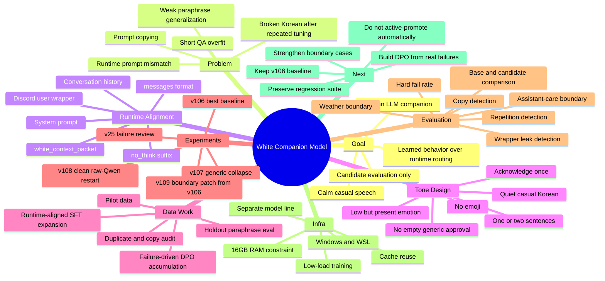

# White Companion Model Mind Map

## Text Outline

White is organized around one central question: can a small Korean companion style be learned by the model itself, without relying on heavy runtime routing?

1. Goal
   - Build a Korean LLM companion centered on SFT, DPO, and later RL.
   - Keep White separate as its own companion direction.
   - Produce candidates, evaluations, and reports only.

2. Core problem
   - Earlier short question/answer SFT made the model memorize exact sentence patterns.
   - Real runtime input is not a plain user prompt. It includes system instructions, context packets, history, and a final Discord-style wrapper.
   - Copying, generic acknowledgements, broken Korean, and boundary confusion became the main failure modes.

3. Data strategy
   - Move from plain prompt/completion to runtime-aligned `messages`.
   - Audit every dataset for duplicate answers, copy-prone rows, unnatural tone, and broken text.
   - Keep holdout prompts paraphrased and separate from training rows.

4. Evaluation strategy
   - Compare base and candidate adapters against the same holdout.
   - Track hard failures rather than only surface fluency.
   - Convert real clear failures into DPO chosen/rejected pairs.

5. Current decision
   - v106 is still the strongest baseline.
   - v109 is a useful boundary patch but not a promotion target.
   - The next useful work is preference training from accumulated real failures.
